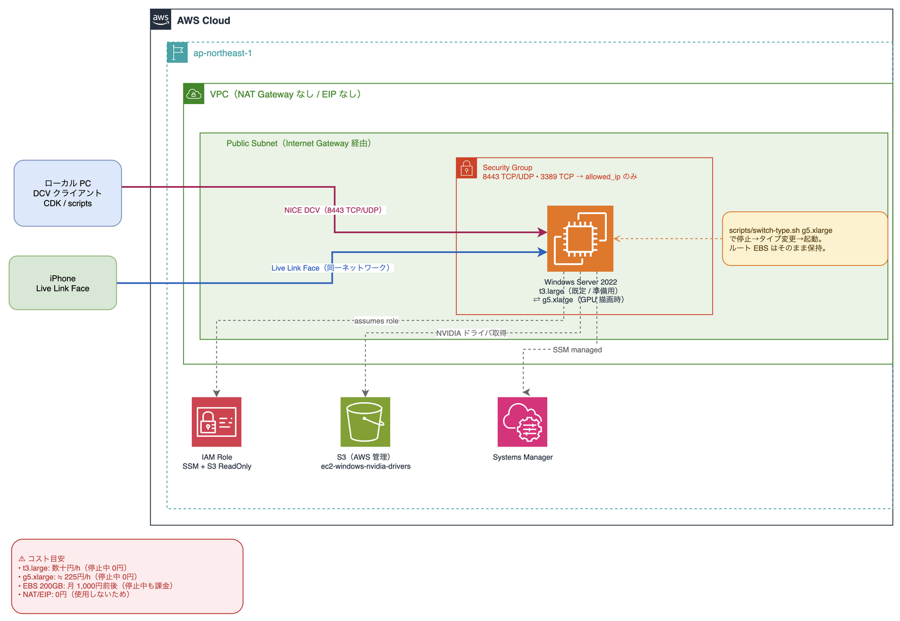

# metahuman-gpu-dcv-trial

MetaHuman / Unreal Engine / Live Link Face を **AWS の GPU インスタンスで短時間だけお試し**するための、リモートワークステーションを CDK 一発で立てる構成です。

普段の準備作業(Unreal や MetaHuman アセットのダウンロード・インストール)は GPU が不要なので、**既定では安い `t3.large` で起動**し、**実際に描画する時だけ `g5.xlarge` 等へ切り替えて**使います。ルート EBS はタイプを変えても保持されるため、準備した内容はそのまま残ります。

> ⚠️ **コスト最重要**
> - GPU(`g5.xlarge`)は **起動中 約 $1.4〜1.5/h(≒225円/h)** かかります。
> - 停止中も EBS(gp3 200GB)で **月 1,000 円前後**が残ります。完全に止めるには `cdk destroy`。
> - 自動停止は CDK には含みません。**停止運用は別途用意した仕組み(LINE リマインダー等)で行う**前提です。使い終わったら必ず `scripts/stop.sh`。

---

## アーキテクチャ



```
[手元PC: DCV クライアント/ブラウザ] ──NICE DCV(8443 TCP/UDP, 自IPのみ)──▶ EC2 (Windows Server 2022)
[iPhone: Live Link Face]          ──(同ネットワーク)─────────────────▶   既定 t3.large(GPUなし/準備用)
                                                                         切替 g5.xlarge(A10G 24GB/描画用)
ネットワーク: 新規 VPC / NAT なし / パブリックサブネット / EIP なし(停止中の放置課金ゼロ)
```

- 自動停止・予算アラートなどのコスト安全装置は**含めていません**(外部運用に委ねる方針)。
- NVIDIA ドライバと NICE DCV は UserData(PowerShell)で自動導入を試みます。GPU 機種に切り替えた初回にドライバが自動で入ります。

## 前提

- AWS CLI / 認証情報(`.env` でも可)、Node.js、`pnpm`
- 既存のキーペア(Windows の Administrator パスワード復号に必要)

## セットアップ

```bash
git clone https://github.com/furuya02/metahuman-gpu-dcv-trial.git
cd metahuman-gpu-dcv-trial/cdk
pnpm install

# 初回のみ
pnpm cdk bootstrap

# キーペアが無ければ作成
aws ec2 create-key-pair --key-name metahuman-key \
  --query KeyMaterial --output text > ~/.ssh/metahuman-key.pem

# デプロイ(allowed_ip と key_name は必須)
pnpm cdk deploy \
  -c allowed_ip=$(curl -s https://checkip.amazonaws.com)/32 \
  -c key_name=metahuman-key
```

### context パラメータ

| キー | 必須 | 既定 | 用途 |
|---|---|---|---|
| `allowed_ip` | ◯ | なし | DCV/RDP を許可する自分の IP(例 `203.0.113.10/32`) |
| `key_name` | ◯ | なし | Administrator パスワード復号用の既存キーペア名 |
| `suffix` | - | アカウントID | リソース名サフィックス |
| `instance_type` | - | `t3.large` | 起動タイプ(準備は t3、GPU は switch-type.sh で切替) |
| `volume_gb` | - | `200` | ルート EBS サイズ(GB) |

## 使い方

```bash
cd metahuman-gpu-dcv-trial

# 起動 / 停止
scripts/start.sh
scripts/stop.sh                 # 使い終わったら必ず

# 接続先(パブリック IP)を確認 … 起動ごとに IP は変わる
scripts/connect-info.sh

# GPU が必要になったら切り替え(停止→変更→起動。EBS は保持)
scripts/switch-type.sh g5.xlarge
# 準備作業に戻すとき
scripts/switch-type.sh t3.large
```

### 接続(NICE DCV)

1. `scripts/connect-info.sh` で `https://<IP>:8443` を確認
2. NICE DCV クライアント(またはブラウザ)で接続
3. ユーザー `Administrator` / パスワードは EC2 コンソール > 対象インスタンス > 「接続」 > 「RDP クライアント」 > 「パスワードを取得」(キーペアの .pem を使用)

### MetaHuman / Unreal / Live Link Face(手動)

本テンプレートは GPU 環境と接続までを用意します。以下は接続後に手動で実施してください。

- Epic Games Launcher → Unreal Engine インストール
- MetaHuman プラグイン / Quixel Bridge で MetaHuman アセット取得
- iPhone の Live Link Face アプリ → 同ネットワークで Unreal の Live Link に接続

> 重い DL/インストールは GPU 不要なので `t3.large` のまま実施し、描画確認時に `g5.xlarge` へ切り替えると安く済みます。

## 後片付け

```bash
scripts/stop.sh                 # 一時停止(EBS 課金は残る)
cd cdk && pnpm cdk destroy      # 完全削除(EBS も消える)
```

## 補足

- OS は Windows Server 2022。Linux 版は対象外です(Epic Games Launcher / MetaHuman アセット取得が Windows/Mac 前提のため)。
- インスタンスタイプは x86 系で揃える必要があります(g5 は x86_64。Graviton(ARM)の t4g/c7g は不可)。

## トラブルシューティング / 手動フォールバック

UserData (PowerShell) による自動導入は初回起動の環境によって失敗する場合があります。DCV で接続できない、または `nvidia-smi` が見つからない場合は以下の手順で手動導入してください。RDP(3389) で Administrator としてログインし、PowerShell(管理者)を開いて実行します。

### NICE DCV が起動していない場合

```powershell
# インストール済み確認
Test-Path 'C:\Program Files\NICE\DCV\Server\bin\dcv.exe'
# False なら手動インストール

Invoke-WebRequest `
  -Uri https://d1uj6qtbmh3dt5.cloudfront.net/nice-dcv-server-x64-Release.msi `
  -OutFile C:\dcv.msi
Start-Process msiexec.exe `
  -ArgumentList '/i C:\dcv.msi /quiet /norestart ADDLOCAL=ALL' -Wait

# コンソールセッションが存在するか確認(dcvserver サービス起動後)
& 'C:\Program Files\NICE\DCV\Server\bin\dcv.exe' list-sessions
# "console" が表示されれば OK
```

インストール後にサービスが起動しない場合は再起動してください。

```powershell
Restart-Computer -Force
```

### NVIDIA ドライバが入っていない場合（g5 系にのみ必要）

```powershell
# GPU の有無を確認(g5 系なら NVIDIA が見えるはず)
Get-WmiObject Win32_VideoController | Select-Object Name

# nvidia-smi がなければ手動インストール
Test-Path 'C:\Windows\System32\nvidia-smi.exe'
# False なら以下を実行

New-Item -ItemType Directory -Force -Path C:\nvidia | Out-Null
aws s3 cp --recursive s3://ec2-windows-nvidia-drivers/latest/ C:\nvidia\

$exe = Get-ChildItem C:\nvidia -Filter *.exe -Recurse | Select-Object -First 1
Start-Process -FilePath $exe.FullName -ArgumentList '-s -noreboot' -Wait
Restart-Computer -Force
```

再起動後に `nvidia-smi` で GPU が認識されていれば導入完了です。
